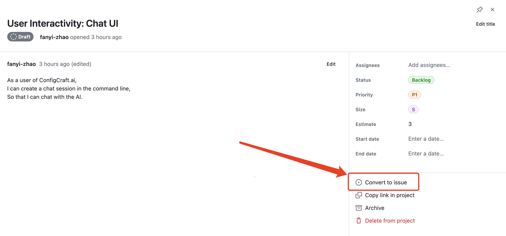
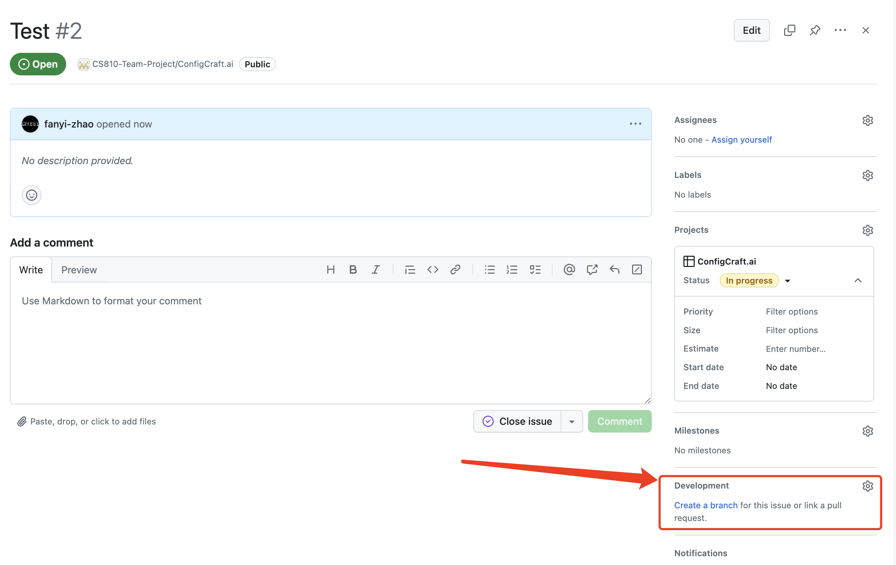

# ConfigCraft.ai
## Introduction
This project aims to provide a simple and easy-to-use configuration generator for the target platform.
## Installation
The project uses Poetry for dependency management. To install Poetry, run the following command: 
```
pip install poetry
```
Install the dependencies:
```
poetry install
```
Run:
```
poetry run python main.py 
```
## Project Structure
1. [main.py](main.py): The entry point of the project.
2. [configcraft/ui](configcraft/ui): The (command line) user interface.
3. [configcraft/generator](configcraft/generator): The configuration generator.
4. [configcraft/validator](configcraft/validator): The configuration validator.
5. [configcraft/model](configcraft/model): Manages the AI model, provides unified interface to operate the model.
## Contributing
Push to main branch is not allowed. Please create a new branch and submit a pull request.
1. Pick a user story / task from the [project board](https://github.com/orgs/CS810-Team-Project/projects/1/views/1).
2. Convert the user story into a issue.

3. Create a new branch from the issue.

4. Make changes and commit.
5. Push the branch to the remote repository.
6. Create a pull request, set the reviewer and assignee.


## References
- [Building RAG from Scratch (Lower-Level)](https://docs.llamaindex.ai/en/stable/optimizing/building_rag_from_scratch/)
    - [Building Data Ingestion from Scratch](https://docs.llamaindex.ai/en/stable/examples/low_level/ingestion/)
    - [Vector Retrieval from Scratch](https://docs.llamaindex.ai/en/stable/examples/low_level/retrieval/)
- [Building RAG from Scratch (Open-source only!)](https://docs.llamaindex.ai/en/stable/examples/low_level/oss_ingestion_retrieval/)
- [Faiss Vector Store](https://docs.llamaindex.ai/en/stable/examples/vector_stores/FaissIndexDemo/)